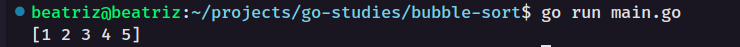

### Bubble sort ou ordenação por flutuação

O algoritmo Bubble Sort ele realiza um loop em uma lista, array, vetor, etc. A cada passagem ele ordena fazendo a troca de posições dos elementos contidos nessa lista para sua posição mais apropriada.

<div align="center">
    
</div>

Exemplo:
```go
func bubbleSort(n []int) []int {
	for i, _ := range n {
		for j := 0; j < len(n)-i-1; j++ {
			if n[j] > n[j+1] {
				n[j], n[j+1] = n[j+1], n[j]
			}
		}
	}

	return n
}

func main() {
	unsorted := []int{1, 5, 4, 3, 2}
	fmt.Println(bubbleSort(unsorted))
}
```

Acima um exemplo simples do algoritmo em Go, onde eu declaro uma função chamada `bubbleSort` que irá ser passada como parâmetro um array de inteiros `n` e irá retornar um array de inteiros. 

Adicionamos um `for` para realizar o loop de `i` onde seu tipo não é relevante `_` e retornará um `range de n`.

>`range` itera com elementos em uma variedade de estruturas de dados.

Depois passamos um `for` de `j` onde basicamente quando passar pelo loop ele irá ignorar o último elemento do array (que irá estar ordenado)

Dentro do `for` de `j` iremos adicionar o `if` realizando a troca de posições dos elementos (ordenação).

<div align="center">
    
</div>

Por último, retornamos o array `n`

Na função `main` criamos um array chamado `unsorted` e passamos valores numéricos (elementos que a serem ordenados)

Por fim, iremos printar o resultado do nosso algoritmo com os elementos ordenados passando `fmt.Println(bubbleSort(unsorted))`

Execute: 
```sh
go run [nome-do-arquivo].go
```

Resultado:

<div align="center">
    
</div>